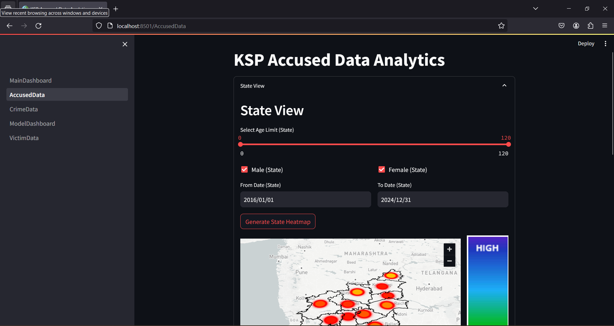

# Predictive Crime Analytics by Enigmatic Energizers

Introducing the Predictive Crime Analytics and Visualization System for Karnataka State, a cutting-edge initiative aimed at revolutionizing crime prevention. By harnessing advanced data analytics and visualization techniques, our project offers deep insights into historical crime trends and forecasts future occurrences. Through comprehensive integration of crime, victim, and accused data, we empower law enforcement agencies with actionable intelligence to enhance public safety and proactive measures. Join us in ushering a new era of data-driven decision-making for a safer Karnataka.

## Collaborators

- [@Arun Pranav A T](https://github.com/arunpranav-at)
- [@Shalini S](https://github.com/ShaliniSJ)
- [@Dhejan ramesh](https://github.com/Dhejan33) 


## Objectives:
- Analyze historical crime data to identify trends and patterns.
- Develop predictive models to forecast future crimes based on various parameters.
- Visualize crime data geospatially and temporally to understand hotspot areas and temporal patterns.
- Provide actionable insights for law enforcement agencies to allocate resources efficiently and prevent crimes effectively.
- Enhance public safety by fostering proactive measures through data-driven decision-making.


## Data Collection and Integration:
- Crime data: Gathered from police records, including details such as type of crime, location, date, time, and other relevant attributes.
- Victim data: Information on individuals affected by crimes, including demographics and details of incidents.
- Accused data: Records of individuals accused or involved in criminal activities, including demographics and offense details.

## Predictive Modeling:
- Utilized machine learning algorithms to build predictive models based on historical crime data.
- Factors considered may include geographical location, time of day, socio-economic factors, and historical crime rates.
- Models were trained to forecast the likelihood of different types of crimes occurring in specific districts and units within Karnataka.


## Visualization and Analysis:
- Geospatial visualization: Map-based representations to identify crime hotspots and spatial patterns across Karnataka.
- Temporal analysis: Time-series visualizations to understand seasonal variations and temporal trends in crime occurrences.
- Comparative analysis: Comparison of crime rates and patterns across different districts and units for informed decision-making.

## System Architecture:
- Backend: Data storage, processing, and predictive modeling using robust frameworks and tools such as Python, Pandas, Numpy and machine learning libraries like Tensorflow, Keras, Pytorch, Scikit-learn and Timeseries.
- Frontend: User-friendly interface for data visualization and analysis, accessible to law enforcement agencies, policymakers, and the public using Streamlit, Plotly, Seaborn, Matplotlib, Geopy.


## Impact and Benefits:
- Empowers law enforcement agencies with actionable insights to proactively prevent crimes and enhance public safety.
- Enables efficient resource allocation and strategic planning based on data-driven decision-making.
- Enhances public awareness and engagement by providing transparent access to crime data and analysis results.


## Steps to run the project:
- Clone this repository locally.
- Install required libraries and packages.
- Start new terminal in VSCode by pressing Ctrl+Shift+` or in any other code editor you use and run the below command.
```
pip install -r requirements.txt
```
- We have included all the packages in requirements.txt. If in case any library or package is missing due to change in the operating system that is being used, the version difference, the package deprecations, etc., we request you to consider the error being displayed and pip install necessary packages and libraries accordingly.
- The folder in functional_components is our playground used to create the project. We request you to have a look only on the MAINFOLDER which has the finalised code with proper arrangement.
- To run the project, first open the MAINFOLDER directory. Run the command below for that.
```
cd .\MAINFOLDER\
```
- Then to view the application, start the streamlit server with the following command.
```
streamlit run .\MainDashboard.py
```
- This will take you to the Home Page (Main Dashboard) of our application. You can navigate to other pages for visualisation and prediction from the UI itself.


## Future Directions:
- Continuous refinement of predictive models through feedback and iterative improvement.
- Integration of additional data sources and advanced analytics techniques to enhance the accuracy and granularity of predictions.
- Collaboration with stakeholders to expand the scope and utility of the system for addressing emerging challenges in crime prevention and public safety.

By leveraging advanced data analytics and visualization capabilities, the Predictive Crime Analysis and Visualization System for Karnataka State aims to revolutionize the way crime is understood, predicted, and addressed, ultimately contributing to a safer and more secure society.

## Explanation video available on YouTube
The whole explanation video is available on YouTube [Click here to watch the youtube video](https://youtu.be/aKzof3DJHA0)<br><br>


# Screenshots of our application:
 
 
 
 
 
 
 
 
 
 
 
 
 
 
 
 
 
 
 
 
 
 

<br><br>


